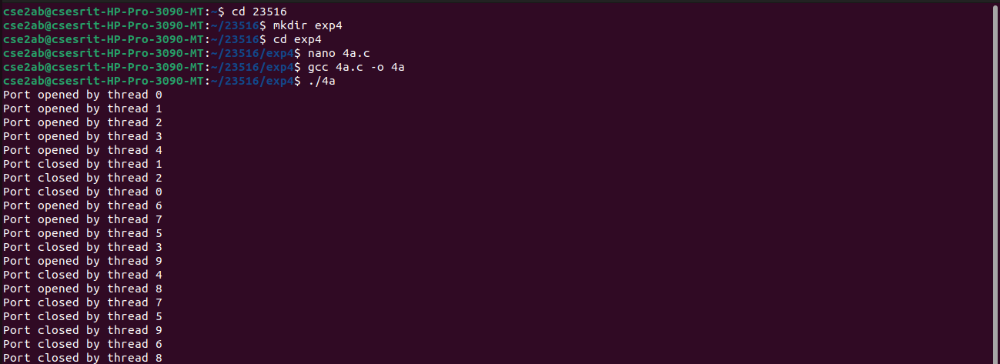

<h1>a) Source Code for Semaphore</h1> 

```c
#include <stdio.h>
#include <unistd.h>
#include <pthread.h>
#include <semaphore.h>

#define MAX_PORTS 5  // Maximum number of ports allowed
sem_t port_semaphore; // Semaphore to control port access

void* open_port(void* arg) {
    sem_wait(&port_semaphore); // Wait if no port is available
    printf("Port opened by thread %ld\n", (long)arg);
    
    // Simulate port usage
    sleep(2);
    
    printf("Port closed by thread %ld\n", (long)arg);
    sem_post(&port_semaphore); // Release the port
    return NULL;
}

int main() {
    pthread_t threads[10];
    sem_init(&port_semaphore, 0, MAX_PORTS); // Initialize semaphore with MAX_PORTS

    for (long i = 0; i < 10; i++) {
        pthread_create(&threads[i], NULL, open_port, (void*)i);
    }

    for (int i = 0; i < 10; i++) {
        pthread_join(threads[i], NULL);
    }

    sem_destroy(&port_semaphore);
    return 0;
}
```


<h1>b) Source Code for Monitors</h1>

```c
#include <stdio.h>
#include <pthread.h>
#include <unistd.h>  // For sleep()

#define MAX_OPEN_PORTS 5  // Define the maximum number of allowed open ports

// Monitor structure to manage ports
typedef struct {
    int available_ports;
    pthread_mutex_t mutex;
    pthread_cond_t condition;
} PortMonitor;

// Function to initialize the monitor
void init_monitor(PortMonitor* monitor) {
    monitor->available_ports = MAX_OPEN_PORTS;
    pthread_mutex_init(&monitor->mutex, NULL);
    pthread_cond_init(&monitor->condition, NULL);
}

// Function to open a port (monitor-like behavior)
void open_port(PortMonitor* monitor, int thread_id) {
    pthread_mutex_lock(&monitor->mutex);  // Enter critical section

    while (monitor->available_ports == 0) {
        pthread_cond_wait(&monitor->condition, &monitor->mutex);  // Wait if no ports are available
    }
    monitor->available_ports--;  // Allocate a port
    printf("Port opened by thread %d\n", thread_id);

    pthread_mutex_unlock(&monitor->mutex);  // Exit critical section
}

// Function to close a port (monitor-like behavior)
void close_port(PortMonitor* monitor, int thread_id) {
    pthread_mutex_lock(&monitor->mutex);  // Enter critical section

    monitor->available_ports++;  // Release the port
    printf("Port closed by thread %d\n", thread_id);
    pthread_cond_signal(&monitor->condition);  // Notify waiting threads

    pthread_mutex_unlock(&monitor->mutex);  // Exit critical section
}

// Thread function
void* port_handler(void* arg) {
    int thread_id = *(int*)arg;
    static PortMonitor monitor = {0};  // Shared monitor instance

    // Initialize monitor only once (for the first thread)
    if (monitor.available_ports == 0) {
        init_monitor(&monitor);
    }

    open_port(&monitor, thread_id);
    sleep(2);  // Simulate port usage
    close_port(&monitor, thread_id);

    return NULL;
}

int main() {
    pthread_t threads[10];
    int thread_ids[10];

    for (int i = 0; i < 10; i++) {
        thread_ids[i] = i;
        pthread_create(&threads[i], NULL, port_handler, &thread_ids[i]);
    }

    for (int i = 0; i < 10; i++) {
        pthread_join(threads[i], NULL);
    }

    return 0;
}
```

